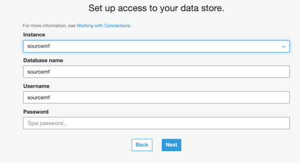
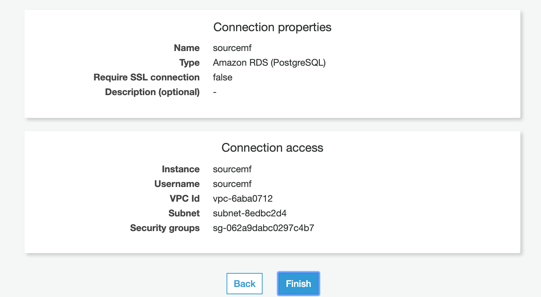
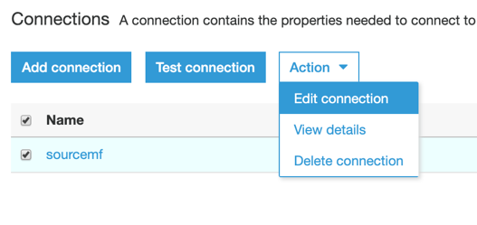
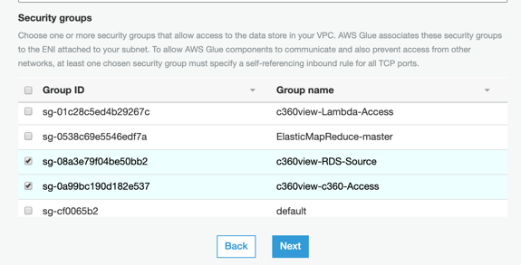
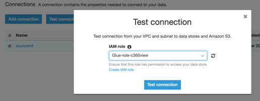
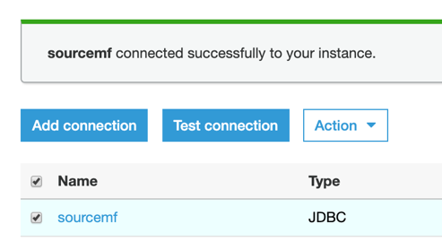
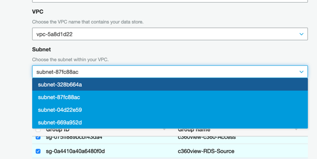

## Create a connection for relational database as source.

**Step 1:** Go to [AWS Glue Database Connections](https://us-west-2.console.aws.amazon.com/glue/home?region=us-west-2#catalog:tab=connections), and Add connection.

*	**Connection name:** sourcemf
*	**Connection type:** Amazon RDS
*	**Database Engine:** PostgreSQL

**Step 2:** Set up access, choosing your Instance sourcemf:

*	**Instance:** sourcemf
*	**Database name:** sourcemf
*	**Username:** sourcemf
*	**Password:** Tim3t0change

**Step 3:** Click on **Finish:**

**Step 4:** Edit your connection to Add a Security group to your connection:

**Step 5:** Check the c360view-c360-Access and c360view-RDS-Source security group:
* **Group name:** c360view-c360-Access and c360view-RDS-Source
* **Password:** Tim3t0change (re-enter it)

**Step 6:** Test your connection:
*	**IAM role:** Glue-role-c360view

**Step 7:** You will see sourcemf connected successfully:

If you receive the following error:

Edit your connection again and change the Subnet to another one.

Then test the connection with the new chosen subnet until it works.

## Setup [Execute a crawler at AWS Glue Console to get tables definitions from your raw bucket](../crawler/README.md)

## License

This library is licensed under the MIT-0 License. See the LICENSE file.
