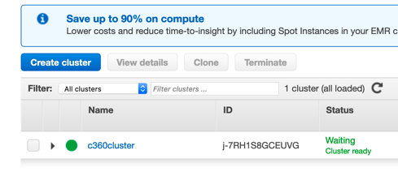
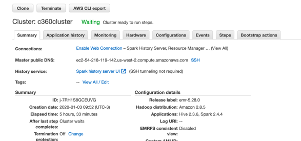
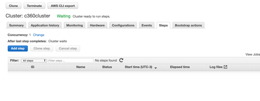
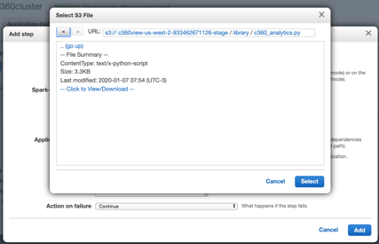
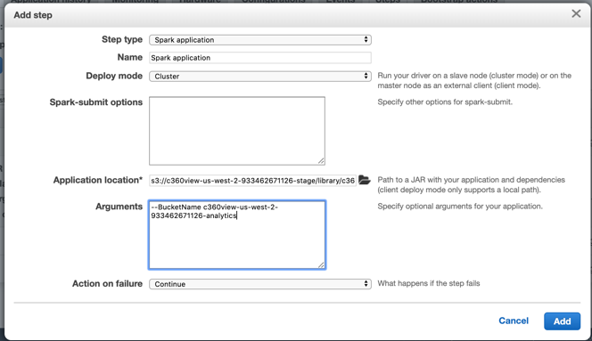
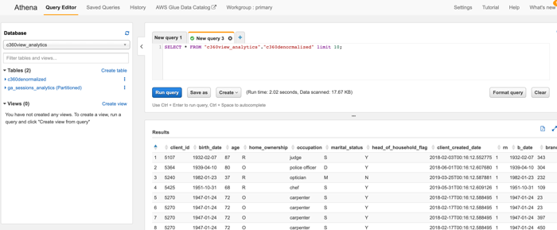

## To create a denormalized table we are going to run a job on Amazon EMR.

Amazon EMR is a powerful cluster, that you can set with few machines like in this blog or tens to thousands of machines. Consider using spot instances for batch processing and terminate your clusters when you are not using, storing your job results on Amazon S3.

**Step 1:** Go to [EMR console](https://us-west-2.console.aws.amazon.com/elasticmapreduce/home?region=us-west-2).

**Step 2:** click on c360cluster.

**Step 3:** click on Steps tab.

**Step 4:** Add step.
*	**Step type:** Spark application
*	**Name:** denormalization
*	**Deploy mode:** Cluster
*	**Spark-submit option:** leave blank
*	**Application location:** s3://**<your_stage_bucket>**/library/c360_analytics.py
Use the bucket browser to select the application location.

*	**Arguments:** --BucketName <your analytics bucket>
Pick the name from Amazon S3 console
*Leave a space between --BucketName and your bucket name.*

**Step 5:** check the job status, going from pending to running.

After completion the job has created a denormalized table using PySpark.

**Step 6:** go to [Athena console](https://us-west-2.console.aws.amazon.com/athena/home?region=us-west-2#query) and check the new c360denormalized table on c360view_analytics database.

## [Populate an Amazon DynamoDB table with the results to be the source for low latency queries from your applications or APIs.](../ddb/README.md)

## License

This library is licensed under the MIT-0 License. See the LICENSE file.
