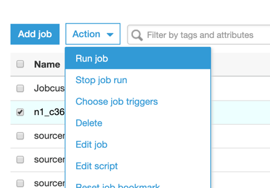
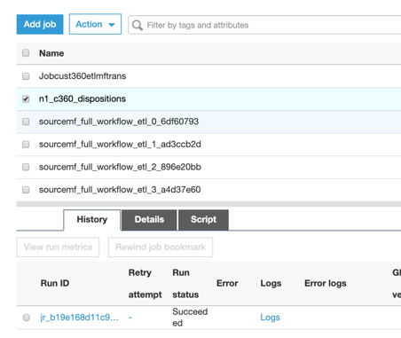
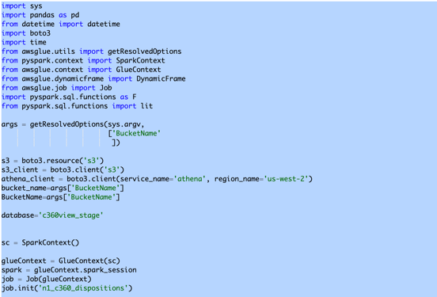
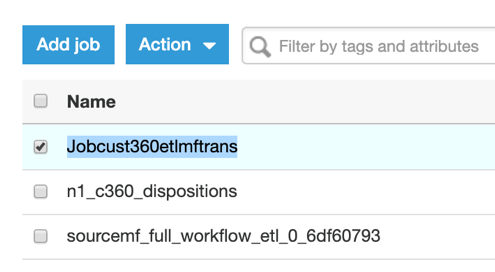
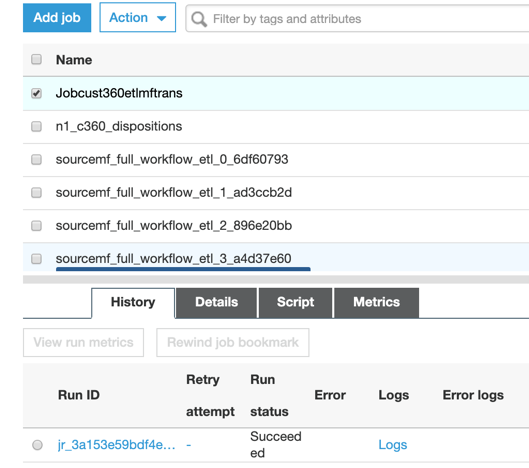
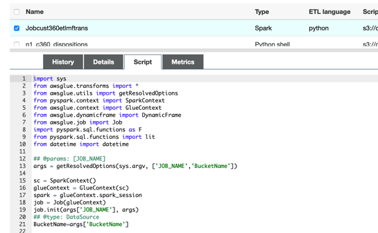

## Now you are going to perform more advanced transformations using AWS Glue job, first using python shell, then with Pyspark.

**Step 1:** Go to [AWS Glue jobs console](https://us-west-2.console.aws.amazon.com/glue/home?region=us-west-2#etl:tab=jobs), select n1_c360_dispositions, Python shell job.

The transformation inside this job performs a join between 3 tables, general banking, account and card, to calculate disposition type and acquisition information.

**Step 2:** Click on Action, Run job.

**Step 3:** Wait for completion.

**Step 4:** Check the script and logs.

Notice that in this Pyspark script that converts a query result from Amazon Athena to a Pandas data frame and then the result from Pandas transformation to parquet files in Amazon S3 using spark write operation.

**Step 5:** Now select the **Jobcust360etlmftrans**, another Pyspark job, Action and run job.

**Step 6:** Wait for completion.

**Step 7:** Check the script and logs.

In this pyspark script we are doing some aggregations with the transactions from relational database done by account_id in the last 3 months and also the last 6 months. For this we used the AWS Glue dynamic frame.

## [Run the Glue crawler Crawler360jobtables3m, Crawler360jobtables6m to pick up definition for the data just created by the last job.](../glue/README.md)

## License

This library is licensed under the MIT-0 License. See the LICENSE file.
